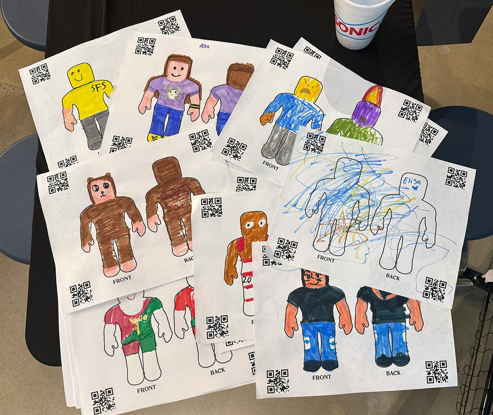

# Dancing Characters




This project lets kids color a character then see it dance on screen. It's great for classroom parties at school.

It's NodeJS web project hosted via ngrok. The dancing animation is at `/dance` and the scanner is at `/`.

When you scan the image, the client-side javascript detects the QR codes to determine which character was drawn (currently only one) and uses the QR code positioning to normalize the orientation/perspective into a jpg texture.

The dancing animation checks for new character textures periodically and automatically loads any new ones. From scan to dancing normally takes under 10 seconds.

You can customize the scene with a background and floor. You'll also see
remnants of other things i've used such as a moon, stars, etc.

Yes, the code is garbage.


# Getting Started

### Step 1) Print & Color

Print `coloring-sheet.pdf` and color it.

### Step 2) Choose Upload Directory

Set the `uploadDirectory` in `/src/config.js`

### Step 2) Update the Graphics (Optional)

You can easily update the background and characters:

 - ./src/dance/references/general/bg.jpg
 - ./src/dance/references/general/floor.jpg
 - ./src/dance/references/characters/char-1.jpg
 - ./src/dance/references/characters/char-2.jpg
 - ./src/dance/references/characters/char-3.jpg
 - ./src/dance/references/characters/char-4.jpg

Take a panoramic shot for the background & just crop it to the same dimensions as bg.jpg. Then update floor.jpg to match if you'd like.

Characters 1-4 are the "initial" characters that dance, but they get
replaced once you start scanning.

### Step 4) Run The App

```
npm install
npm run dev
```

### Step 5) View The Animation

Open the animation (probably show it on your projector):

> http://0.0.0.0:3000/dance

### Step 6) Scan Your Pictures

Open the scanner (probably on your phone):

> http://0.0.0.0:3000

Then take a picture of the coloring sheet. The app will immediately tell you "success" or an error message. Make sure all 4 QR codes are within frame. Make issue I've run into is - don't let kids color on the QR codes.

### Step 7) Host It Publically (optional)

You'll need an [ngrok](https://ngrok.com/) account and you'll need it installed. Update your settings in `ngrok.yaml` then run it with:

```
npm run start
```

Now you can access the application via the internet. E.g.

> https://go.allstarapps.com (scanner)
> https://go.allstarapps.com/dance (animation)

